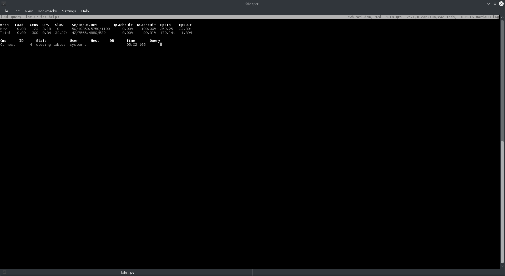

innotop
=======

innotop is a 'top' clone for MySQL with many features and flexibility.

* completely customizable; it even has a plugin interface
* monitors many servers at once and can aggregate across them 

The manual is embedded into the program in Perl's POD format, so it should be available 
through perldoc and man.

The full history has been imported in github.
